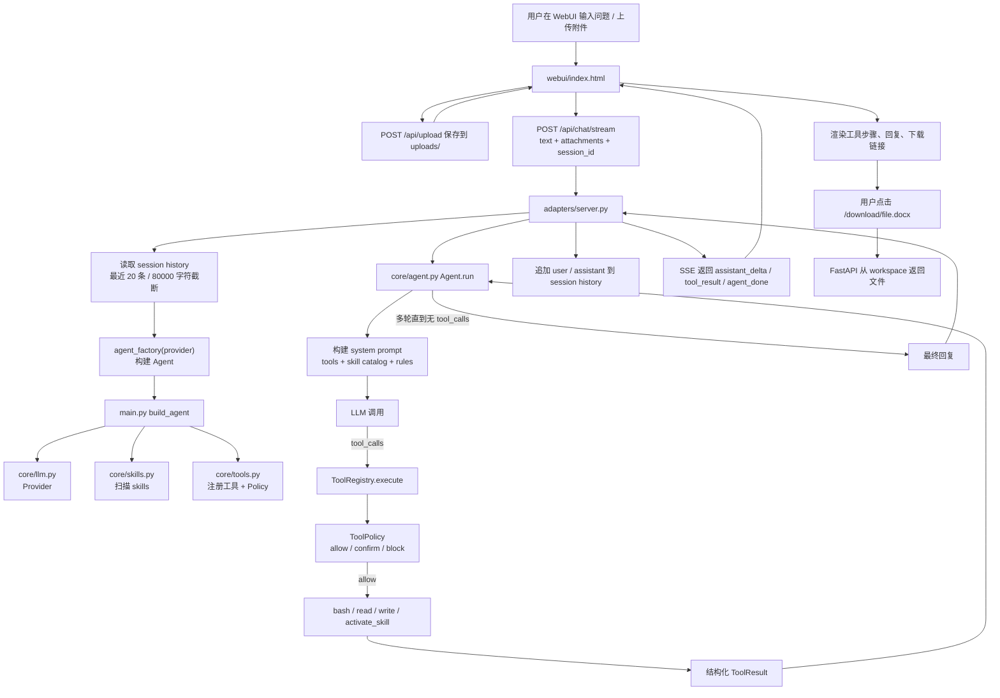

# czon Agent 技术与场景解读

 czon Agent MVP 的整体设计、一次用户请求的完整执行链路、核心代码结构，以及为什么这个版本保持“简洁、优雅、可插拔”。

## 1. 项目定位

czon Agent 不是一个普通聊天机器人，而是一个极简 Agent Runtime。

它的核心目标是：

1. **优先使用 Skills**：垂直能力通过 `skills/` 插拔，不进入 core。
2. **其次使用内置工具**：没有合适 Skill 时，用 `read/write/bash` 完成通用本地任务。
3. **无法解决就明确说明**：不靠大模型话术假装完成。
4. **WebUI 有短期会话上下文**：聊天体验像连续对话，但 Agent 内核仍然无状态。
5. **生成文件走 workspace + 下载链接**：适合浏览器或远程客户端使用。

核心原则可以概括为：

```text
core 保持小
能力通过 skills 增长
adapter 负责不同使用方式
工具结果结构化
高风险动作需要确认
```

## 2. 目录结构

```text
czon_agent/
├── main.py                 # 统一入口：CLI / WebUI / setup
├── config.yaml             # Provider、workspace、agent rules、tool policy 配置
├── core/
│   ├── agent.py            # Agent loop，负责 LLM 调用、tool_calls 执行、历史注入
│   ├── llm.py              # OpenAI-compatible Provider 封装
│   ├── skills.py           # Skill 扫描与 SKILL.md 加载
│   ├── tools.py            # ToolRegistry、ToolPolicy、ToolResult
│   └── logging_setup.py    # 日志初始化
├── tools_builtin/
│   ├── file_ops.py         # read / write
│   ├── shell.py            # bash
│   └── skill_ops.py        # activate_skill
├── adapters/
│   ├── cli.py              # CLI 单次 / 交互模式
│   └── server.py           # FastAPI、SSE、上传、下载、会话历史、确认
├── webui/
│   └── index.html          # 单文件 WebUI
├── skills/
│   ├── hello-world/        # 示例 Skill
│   ├── sqlite-sample/      # 示例 SQLite 查询 Skill
│   └── office-io/          # Word / Excel / PDF / PPT / Markdown 文档 Skill
├── uploads/                # 用户上传输入
├── workspace/              # Agent 生成输出
├── logs/                   # 系统日志
└── data/                   # 示例数据
```

### 目录语义

| 目录 | 角色 | 设计含义 |
|---|---|---|
| `uploads/` | 用户输入 | WebUI 上传文件存放处，Agent 可以读取 |
| `workspace/` | Agent 输出 | 生成或修改后的文件默认放这里 |
| `logs/` | 系统日志 | logging 写入，不作为 Agent 产物目录 |
| `skills/` | 可插拔能力 | 垂直能力通过目录安装 |
| `core/` | 最小执行内核 | 不放具体业务场景 |

## 3. 场景串联：上传 Word，要求修改并下载

以一个典型问题为例：

```text
用户上传 “业务流程方案.docx”
然后输入：
“在这个文件最后加上 席朋飞 2026-04-25 01:26”
```

这个场景会用到：

| 功能 | 所在文件 | 作用 |
|---|---|---|
| 文件上传 | `adapters/server.py` + `webui/index.html` | 把用户文件保存到 `uploads/` |
| 附件传递 | `webui/index.html` + `core/agent.py` | 将上传文件作为 attachment 传给 Agent |
| 短期历史 | `adapters/server.py` | 同一 WebUI 会话中保留上下文 |
| Skill 激活 | `tools_builtin/skill_ops.py` + `core/skills.py` | 加载 `office-io/SKILL.md` |
| 文档读写 | `skills/office-io/scripts/office.py` | 读取 docx 并生成修改后的 docx |
| 命令执行 | `tools_builtin/shell.py` | 通过 bash 运行 skill 脚本 |
| 结果落地 | `workspace/` | 修改后的文件写入 workspace |
| 下载链接 | `adapters/server.py` + `webui/index.html` | `/download/<file>` 返回文件 |

另一个常见场景是本地数据库查询：

```text
“在本地 mysql 数据库中，地址 127.0.0.1，端口 3306，用户 root，密码 xxx，
帮我查询 t_projects 表里的所有数据。”
```

这个场景没有专门的 MySQL Skill，因此按优先级会走通用 `bash`：

1. 先判断没有匹配 Skill。
2. 使用 `bash` 尝试 `mysql ... -e "SELECT ..."`。
3. 如果 mysql 客户端不可用，再由模型根据错误决定是否尝试 Python 方案。
4. 如果工具链都不可用，才明确说明缺少能力，建议增加 MySQL Skill。

这体现了 MVP 的核心原则：**垂直能力不硬塞进 core，高频场景未来再做 Skill。**

## 4. 一次请求的执行流程图



## 5. 核心流程详解

### 5.1 入口：`main.py`

`main.py` 是统一入口，负责根据命令启动 CLI、WebUI 或 setup。

```python
def main():
    parser = argparse.ArgumentParser(...)
    parser.add_argument("command_or_message", nargs="?", help="webui / setup / 或直接输入消息")
    parser.add_argument("message_parts", nargs=argparse.REMAINDER, help="消息剩余内容")
```

这里的设计目标是减少命令复杂度：

```bash
python main.py                 # 默认进入交互 CLI
python main.py "你好"           # 单次 CLI
python main.py webui           # 启动 WebUI
python main.py setup           # 初始化示例数据
```

#### 构建 Agent

```python
def build_agent(config: dict, provider_override: Optional[str] = None):
    llm = make_llm_from_config(config)
    skill_loader = SkillLoader(skills_dir=skills_dir, enabled=enabled)
    skill_loader.scan()

    registry = ToolRegistry(policy=tool_policy)
    file_ops.register(registry, workspace_dir=workspace_dir)
    shell.register(registry)
    skill_ops.register(registry, skill_loader)

    return Agent(...)
```

这段代码把 Agent 的几个核心部件组装起来：

1. `LLM`：负责模型调用。
2. `SkillLoader`：负责扫描可用 Skills。
3. `ToolRegistry`：负责工具注册和执行。
4. `ToolPolicy`：负责风险控制。
5. `Agent`：负责 Agent loop。

这个设计的好处是：`Agent` 本身不关心 provider 怎么来、工具怎么注册、skills 在哪里。它只消费已经组装好的对象。

#### WebUI 模式下追加专属规则

```python
def agent_factory(provider: str):
    webui_rules = config.get("webui", {}).get("extra_rules") or []
    merged_config = {
        **config,
        "agent": {
            **(config.get("agent") or {}),
            "extra_rules": [
                *((config.get("agent") or {}).get("extra_rules") or []),
                *webui_rules,
            ],
        },
    }
    return build_agent(merged_config, provider_override=provider)
```

这里体现了“模式边界”：

- CLI 不需要 `/download/...` 链接。
- WebUI 需要下载链接。
- 所以下载链接规则只在 WebUI 构建 Agent 时注入。

### 5.2 Agent 主循环：`core/agent.py`

`Agent.run()` 是核心执行循环。

```python
def run(
    self,
    user_text: str,
    attachments: Optional[List] = None,
    history: Optional[List[Dict]] = None,
    on_step: Optional[Callable] = None,
    on_delta: Optional[Callable[[str], None]] = None,
) -> Tuple[str, List[Dict]]:
```

它接收：

| 参数 | 作用 |
|---|---|
| `user_text` | 当前用户输入 |
| `attachments` | 上传文件、图片等附件 |
| `history` | adapter 显式传入的短期历史 |
| `on_step` | 工具执行回调，用于 WebUI 显示步骤 |
| `on_delta` | 流式文本回调，用于 SSE |

#### Agent 保持无状态

```python
messages = list(history or [])
messages.append(self._build_user_message(user_text, attachments))
```

这段是关键设计：

- `Agent` 自己不保存历史。
- WebUI 需要历史，就通过 `history` 显式传入。
- CLI 不需要历史，就传 `None`。

这保持了 core 的简洁，同时满足 WebUI 多轮对话体验。

#### 构建 system prompt

```python
tool_names = ", ".join(self.tool_registry.tools.keys()) or "(none)"
extra_rules = "\n".join(f"- {rule}" for rule in self.extra_rules)
```

工具列表从 `ToolRegistry` 动态生成，而不是写死。

这样以后新增工具，只要注册进 registry，prompt 自动同步。

#### 工具调用循环

```python
msg = self._complete(system, messages, tools, on_delta=on_delta)

if not msg.tool_calls:
    return msg.content or "", steps
```

如果模型没有工具调用，说明任务完成，直接返回最终回复。

如果模型产生 `tool_calls`：

```python
for tc in msg.tool_calls:
    result = self.tool_registry.execute(tool_name, args)
    messages.append({
        "role": "tool",
        "tool_call_id": tc.id,
        "content": json.dumps(result_payload, ensure_ascii=False),
    })
```

执行工具后，把结构化结果作为 `tool` 消息塞回上下文，让模型继续下一轮推理。

#### DeepSeek reasoning_content 兼容

```python
reasoning_text = _get_field(delta, "reasoning_content")
if reasoning_text:
    reasoning_parts.append(reasoning_text)
```

DeepSeek thinking 模式要求多轮工具调用时回传 `reasoning_content`。这里兼容三种来源：

```python
def _get_field(obj, name: str):
    value = getattr(obj, name, None)
    if value is not None:
        return value

    extra = getattr(obj, "model_extra", None)
    if isinstance(extra, dict):
        return extra.get(name)

    if isinstance(obj, dict):
        return obj.get(name)
```

这保证 DeepSeek 在流式 + 工具调用场景下不会丢失 reasoning 内容。

### 5.3 LLM 抽象：`core/llm.py`

`LLM` 负责封装 Kimi、Qwen、DeepSeek 这类 OpenAI-compatible 接口。

```python
PROVIDERS = {
    "kimi": {...},
    "qwen": {...},
    "deepseek": {...},
}
```

模型调用统一走：

```python
response = self.client.chat.completions.create(**kwargs)
```

流式调用：

```python
kwargs["stream"] = True
return self.client.chat.completions.create(**kwargs)
```

对于不支持视觉的模型，如 DeepSeek：

```python
if not self._supports_vision:
    messages = self._strip_images(messages)
```

它会把图片输入替换成文本提示，避免 provider 直接报错。

### 5.4 Skill 加载：`core/skills.py`

Skill 是这个项目的可插拔能力核心。

每个 Skill 是一个目录：

```text
skills/office-io/
├── SKILL.md
└── scripts/office.py
```

`SkillLoader.scan()` 会扫描 `skills/`：

```python
for subdir in sorted(self.skills_dir.iterdir()):
    skill_file = subdir / "SKILL.md"
    meta = self._parse_skill_file(skill_file, subdir)
    self.catalog[meta.name] = meta
```

它只把 `name` 和 `description` 放进 catalog，完整 `SKILL.md` 不会一开始全塞进 prompt。

#### 为什么这样设计

如果一启动就把所有 Skill 全文塞进 prompt：

- prompt 会变长。
- 模型容易混淆。
- Skill 越多越不可控。

现在的方式是：

1. system prompt 只给 Skill 目录。
2. 模型判断需要某个 Skill。
3. 调用 `activate_skill(name)`。
4. 再加载完整说明。

这叫按需加载，既省上下文，又更可控。

### 5.5 工具系统：`core/tools.py`

`ToolRegistry` 统一管理工具。

```python
def register(self, name: str, description: str, parameters: dict, handler: Callable):
    self.tools[name] = {
        "schema": {...},
        "handler": handler,
    }
```

这让工具有两个身份：

1. 给模型看的 function calling schema。
2. 后端实际执行的 handler。

#### 结构化结果

```python
@dataclass
class ToolResult:
    ok: bool
    data: Any = None
    error: Optional[ToolError] = None
    meta: Dict[str, Any] = field(default_factory=dict)
```

这比以前简单塞字符串更可靠。

模型能看到：

```json
{
  "ok": false,
  "error": {
    "type": "CommandFailed",
    "message": "bash 命令执行失败，exit_code=1"
  }
}
```

于是它可以基于错误类型做下一步，而不是猜字符串含义。

#### ToolPolicy

```python
if decision.action == "block":
    return ToolResult.failure("PolicyBlocked", ...)

if decision.action == "confirm" and not confirmed:
    return ToolResult.failure("ConfirmationRequired", ...)
```

策略层只有三类：

| action | 意义 |
|---|---|
| `allow` | 直接执行 |
| `confirm` | 等用户确认 |
| `block` | 拒绝执行 |

当前策略保持“薄”：

- 高危命令直接 block：`rm -rf /`、`sudo`、`shutdown` 等。
- 风险动作确认：`rm`、`mv`、`chmod`、`chown`。
- 普通命令默认允许。

这样不会误伤 `curl`、`pip install`、SQL 查询这类常见场景。

## 6. 内置工具

### 6.1 `read/write`：`tools_builtin/file_ops.py`

`read` 开放读取：

```python
def read_file(path: str) -> str:
    p = Path(path)
    if not p.exists():
        return f"[error] 文件不存在：{path}"
```

为什么 read 不限制目录？

因为 Agent 要读取：

- 上传文件 `uploads/`
- 生成文件 `workspace/`
- Skill 说明 `skills/`
- 示例数据 `data/`
- 用户明确指定的本地文件

如果 read 收窄，Agent 会看不到用户给的文件。

`write` 只允许写入 workspace：

```python
allowed_dir = Path(workspace_dir).resolve()
p = Path(path).resolve()
p.relative_to(allowed_dir)
```

这里用 `relative_to()` 做边界检查，可以挡住：

- 写到项目根目录
- 写到 `uploads/`
- 写到 `logs/`
- `../` 路径穿越
- 绝对路径越界

设计含义：

```text
uploads  是输入
workspace 是输出
logs     是系统日志
```

### 6.2 `bash`：`tools_builtin/shell.py`

`bash` 是高自由度工具。

```python
proc = subprocess.run(
    command,
    shell=True,
    capture_output=True,
    timeout=timeout,
    text=True,
)
```

返回结构化结果：

```python
return {
    "command": command,
    "exit_code": proc.returncode,
    "stdout": stdout,
    "stderr": stderr,
    "timed_out": False,
    "truncated": ...
}
```

这样前端可以显示工具步骤，Agent 也能判断命令是否真的成功。

### 6.3 `activate_skill`：`tools_builtin/skill_ops.py`

这个工具按需加载 Skill 说明。

模型看到 Skill catalog 后，如果判断需要某个 Skill，会调用：

```json
{"name": "office-io"}
```

后端返回该 Skill 的完整 `SKILL.md` 正文。

这就是 Skills 可插拔的关键入口。

## 7. WebUI 与 Server

### 7.1 FastAPI：`adapters/server.py`

Server 负责 WebUI 场景下的 adapter 逻辑：

- 静态页面
- 上传文件
- SSE 流式输出
- 工具步骤推送
- 用户确认
- session history
- workspace 下载

#### 上传

```python
@app.post("/api/upload")
def upload(file: UploadFile = File(...)):
    dest = UPLOADS_DIR / f"{uuid.uuid4().hex}{suffix}"
```

上传文件会被重命名为 UUID，避免中文文件名、重名、特殊字符带来的路径问题。

返回结构：

```json
{
  "path": "uploads/xxx.docx",
  "name": "原始文件名.docx",
  "mime": "...",
  "size": 12345
}
```

#### SSE 流式

```python
@app.post("/api/chat/stream")
def chat_stream(req: ChatRequest):
    ...
    return StreamingResponse(event_gen(), media_type="text/event-stream")
```

事件包括：

| 事件 | 说明 |
|---|---|
| `agent_start` | 开始处理 |
| `assistant_delta` | 模型文本增量 |
| `tool_result` | 工具执行完成 |
| `confirmation_required` | 等待用户确认 |
| `agent_done` | 最终完成 |
| `agent_error` | 后端异常 |

#### 短期会话历史

```python
sessions = {}
session_lock = threading.Lock()
```

每个 WebUI 标签页会带 `session_id`。

```python
def append_history(session_id, user_text, attachments, assistant_text):
    history.append({"role": "user", "content": ...})
    history.append({"role": "assistant", "content": assistant_text or ""})
    sessions[session_id] = _trim_history(history)
```

MVP 不做语义筛选，只做规则截断：

```python
MAX_HISTORY_MESSAGES = 20
MAX_HISTORY_CHARS = 80_000
```

为什么不做“相关历史筛选”？

- 需要额外 LLM 调用。
- 筛错会引发严重上下文丢失。
- LLM 本身能忽略无关上下文。

所以当前策略是：

```text
保留最近上下文
超长从最旧开始截断
用户通过“新对话”主动清空
```

#### 下载 workspace 文件

```python
@app.get("/download/{file_path:path}")
def download_workspace_file(file_path: str):
    target = (workspace_root / file_path).resolve()
    target.relative_to(workspace_root)
    return FileResponse(str(target), filename=target.name)
```

这里同样使用 `relative_to()` 防止下载 workspace 外的文件。

最终给用户的链接是：

```markdown
[下载文件](/download/report.docx)
```

### 7.2 WebUI：`webui/index.html`

WebUI 是单文件前端，职责是：

- 文件上传
- 输入消息
- 选择模型
- 显示工具步骤
- SSE 流式接收
- 确认危险操作
- 新对话
- 渲染下载链接

#### session_id

```javascript
const ss = sessionStorage;
let sessionId = ss.getItem('czon_agent_session_id') || createSessionId();
ss.setItem('czon_agent_session_id', sessionId);
```

使用 `sessionStorage` 的含义：

- 同一个标签页刷新仍保留 session。
- 关闭标签页后 session 消失。
- 不做长期记忆。

#### 新对话

```javascript
async function newChat() {
  const oldSessionId = sessionId;
  sessionId = createSessionId();
  ss.setItem('czon_agent_session_id', sessionId);
  ...
  await fetch('/api/session/reset', ...)
}
```

这是比智能筛选更优雅的上下文切换方式：让用户自己决定什么时候开始新话题。

#### 发送消息

```javascript
await streamChat(agentMsgId, { text, attachments, provider, session_id: sessionId });
```

每次请求都会带：

- 当前文本
- 附件
- 模型 provider
- session_id

#### 下载链接渲染

```javascript
function renderMessage(text) {
  const escaped = escHtml(text);
  return escaped.replace(/\[([^\]\n]+)\]\((\/download\/[^)\s]+)\)/g, ...)
}
```

只渲染 `/download/...` 这种本系统下载链接，避免开放式 Markdown 渲染带来安全复杂度。

## 8. Office Skill 示例

`skills/office-io` 是一个典型垂直能力 Skill。

```text
skills/office-io/
├── SKILL.md
└── scripts/office.py
```

`SKILL.md` 告诉模型：

- 什么时候使用这个 Skill。
- 支持哪些格式。
- 如何运行脚本。
- 写入文件时输出到 `workspace/`。
- 最终回复提供 `/download/...` 链接。

`office.py` 提供实际能力：

| 命令 | 作用 |
|---|---|
| `inspect` | 查看文件类型、大小、MIME |
| `read` | 读取 md/txt/csv/docx/xlsx/pdf/pptx |
| `write-md` | 写 Markdown |
| `write-docx` | 写 Word |
| `write-xlsx` | 写 Excel |
| `write-pptx` | 写 PPT |
| `write-pdf` | 写简单文本 PDF |

例如：

```bash
python skills/office-io/scripts/office.py read uploads/example.docx
python skills/office-io/scripts/office.py write-docx workspace/report.docx --text "内容"
```

为什么 Office 能力放在 Skill，而不是 core？

因为办公文档是垂直能力。今天是 Word / Excel，明天可能是 CAD、ERP、财务报表、医学影像。如果都进 core，MVP 会迅速膨胀。

Skill 机制让核心保持小，而能力可以增长。

## 9. 为什么说这个设计简洁优雅

### 9.1 core 小

core 只做几件事：

```text
Agent loop
LLM 调用
Skill 扫描
Tool 注册与执行
结构化结果
```

它不关心：

- WebUI 怎么长。
- 文件怎么下载。
- Office 怎么解析。
- SQLite 怎么查。
- 用户会话怎么持久化。

这些都放在 adapter 或 skill。

### 9.2 能力可插拔

新增一个 Skill 只需要：

```text
skills/my-skill/
├── SKILL.md
└── scripts/run.py
```

`SKILL.md` frontmatter：

```markdown
---
name: my-skill
description: 描述这个 skill 什么时候应该被使用。
---
```

重启后 `SkillLoader.scan()` 自动发现它。

### 9.3 Adapter 分层清楚

```text
CLI adapter:
  无需 WebUI session
  默认本地交互

WebUI adapter:
  维护 session history
  提供上传 / 下载 / SSE / 确认

Agent core:
  仍然无状态
```

这意味着 WebUI 的复杂性不会污染 Agent 内核。

### 9.4 安全边界少但明确

```text
read  开放读取
write 只写 workspace
bash  高危命令 block / 风险命令 confirm
download 只允许 workspace
```

不是复杂沙箱，但 MVP 阶段边界清晰。

## 10. 设计理念


1. **定位**：不是聊天机器人，是执行型 Agent Runtime。
2. **目录边界**：uploads 输入、workspace 输出、skills 能力、core 内核。
3. **案例: Word 修改场景**：上传、附件、激活 office skill、bash 执行、workspace 输出、下载。
4. ** Agent loop**：LLM 决策、tool_calls、工具结果回填、多轮直到最终回复。
5. ** Skills 插拔**：为什么 Office / SQLite 不进 core。
6. ** WebUI 会话历史**：adapter 层维护 session，core 保持无状态。
7. **简洁性**：少量核心概念支撑未来扩展。


```text
czon Agent 的 MVP 不是把所有功能都做进核心，而是搭好一个小而稳的执行内核；
未来的能力通过 Skills 生长，WebUI/CLI 通过 adapters 使用它。
```
